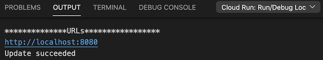
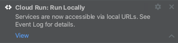

# Cloud Run Cripto Analytics com Cloud Code

"Cripto Analytics" é um aplicativo [Cloud Run](https://cloud.google.com/run/docs) que renderiza uma página web simples.

Para detalhes sobre como usar este exemplo como um modelo no Cloud Code, leia a documentação do Cloud Code para [VS Code](https://cloud.google.com/code/docs/vscode/quickstart-cloud-run?utm_source=ext&utm_medium=partner&utm_campaign=CDR_kri_gcp_cloudcodereadmes_012521&utm_content=-) ou [IntelliJ](https://cloud.google.com/code/docs/intellij/quickstart-cloud-run?utm_source=ext&utm_medium=partner&utm_campaign=CDR_kri_gcp_cloudcodereadmes_012521&utm_content=-).

### Índice

- [Iniciando com o VS Code](#iniciando-com-o-vs-code)
- [Iniciando com o IntelliJ](#iniciando-com-o-intellij)
- [Inscreva-se para Pesquisa de Usuário](#inscreva-se-para-pesquisa-de-usuário)

---

## Iniciando com o VS Code

### Execute o aplicativo localmente com o Emulador do Cloud Run

1. Clique na barra de status do Cloud Code e selecione 'Executar no Emulador do Cloud Run'.
   

2. Use o diálogo do Emulador do Cloud Run para especificar sua [opção de construtor](https://cloud.google.com/code/docs/vscode/deploying-a-cloud-run-app#deploying_a_cloud_run_service). O Cloud Code suporta Docker, Jib e Buildpacks. Consulte a documentação do skaffold sobre [construtores](https://skaffold.dev/docs/pipeline-stages/builders/) para mais informações sobre tipos de artefato de construção.
   

3. Clique em 'Executar'. O Cloud Code começa a construir sua imagem.

4. Veja o progresso da construção na janela de SAÍDA. Uma vez que a construção tenha terminado, clique na URL na janela de SAÍDA para visualizar sua aplicação ao vivo.
   

5. Para parar a aplicação, clique no ícone de parada na Barra de Ferramentas de Depuração.

---

## Iniciando com o IntelliJ

### Execute o aplicativo localmente com o Emulador do Cloud Run

#### Defina a configuração de execução

1. Clique no menu suspenso de configurações de Execução/Depuração na barra de tarefas superior e selecione 'Editar Configurações'.
   

2. Selecione 'Cloud Run: Executar Localmente' e especifique sua [opção de construtor](https://cloud.google.com/code/docs/intellij/developing-a-cloud-run-app#defining_your_run_configuration). O Cloud Code suporta Docker, Jib e Buildpacks. Consulte a documentação do skaffold sobre [construtores](https://skaffold.dev/docs/pipeline-stages/builders/) para mais informações sobre tipos de artefato de construção.
   

#### Execute a aplicação

1. Clique no menu suspenso de configurações de Execução/Depuração e selecione 'Cloud Run: Executar Localmente'. Clique no ícone de execução.
   

2. Veja o processo de construção na janela de saída. Uma vez que a construção tenha terminado, você receberá uma notificação do Log de Eventos. Clique em 'Visualizar' para acessar as URLs locais para seus serviços implantados.
   

---

## Inscreva-se para Pesquisa de Usuário

Queremos ouvir seu feedback!

A equipe do Cloud Code convida nossa comunidade de usuários a se inscrever para participar da Pesquisa de Experiência do Usuário do Google.

Se você for convidado para participar de um estudo, poderá experimentar um novo produto ou nos contar o que você pensa sobre os produtos que você usa todos os dias. Neste momento, o Google está enviando convites apenas para estudos remotos futuros. Após a conclusão de um estudo, você receberá um token de agradecimento por sua participação, como um cartão-presente ou alguns brindes do Google.

[Inscreva-se usando este link](https://google.qualtrics.com/jfe/form/SV_4Me7SiMewdvVYhL?reserved=1&utm_source=In-product&Q_Language=en&utm_medium=own_prd&utm_campaign=Q1&productTag=clou&campaignDate=January2021&referral_code=UXbT481079) e responda algumas perguntas sobre você, pois isso ajudará nossa equipe de pesquisa a combiná-lo com estudos que se encaixem bem.

# Cloud Run Hello World with Cloud Code

"Hello World" is a [Cloud Run](https://cloud.google.com/run/docs) application that renders a simple webpage.

For details on how to use this sample as a template in Cloud Code, read the documentation for Cloud Code for [VS Code](https://cloud.google.com/code/docs/vscode/quickstart-cloud-run?utm_source=ext&utm_medium=partner&utm_campaign=CDR_kri_gcp_cloudcodereadmes_012521&utm_content=-) or [IntelliJ](https://cloud.google.com/code/docs/intellij/quickstart-cloud-run?utm_source=ext&utm_medium=partner&utm_campaign=CDR_kri_gcp_cloudcodereadmes_012521&utm_content=-).

### Table of Contents

- [Getting Started with VS Code](#getting-started-with-vs-code)
- [Getting Started with IntelliJ](#getting-started-with-intellij)
- [Sign up for User Research](#sign-up-for-user-research)

---

## Getting Started with VS Code

### Run the app locally with the Cloud Run Emulator

1. Click on the Cloud Code status bar and select 'Run on Cloud Run Emulator'.
   

2. Use the Cloud Run Emulator dialog to specify your [builder option](https://cloud.google.com/code/docs/vscode/deploying-a-cloud-run-app#deploying_a_cloud_run_service). Cloud Code supports Docker, Jib, and Buildpacks. See the skaffold documentation on [builders](https://skaffold.dev/docs/pipeline-stages/builders/) for more information about build artifact types.
   

3. Click ‘Run’. Cloud Code begins building your image.

4. View the build progress in the OUTPUT window. Once the build has finished, click on the URL in the OUTPUT window to view your live application.
   

5. To stop the application, click the stop icon on the Debug Toolbar.

---

## Getting Started with IntelliJ

### Run the app locally with the Cloud Run Emulator

#### Define run configuration

1. Click the Run/Debug configurations dropdown on the top taskbar and select 'Edit Configurations'.
   

2. Select 'Cloud Run: Run Locally' and specify your [builder option](https://cloud.google.com/code/docs/intellij/developing-a-cloud-run-app#defining_your_run_configuration). Cloud Code supports Docker, Jib, and Buildpacks. See the skaffold documentation on [builders](https://skaffold.dev/docs/pipeline-stages/builders/) for more information about build artifact types.
   

#### Run the application

1. Click the Run/Debug configurations dropdown and select 'Cloud Run: Run Locally'. Click the run icon.
   

2. View the build process in the output window. Once the build has finished, you will receive a notification from the Event Log. Click 'View' to access the local URLs for your deployed services.
   

---

## Sign up for User Research

We want to hear your feedback!

The Cloud Code team is inviting our user community to sign-up to participate in Google User Experience Research.

If you’re invited to join a study, you may try out a new product or tell us what you think about the products you use every day. At this time, Google is only sending invitations for upcoming remote studies. Once a study is complete, you’ll receive a token of thanks for your participation such as a gift card or some Google swag.

[Sign up using this link](https://google.qualtrics.com/jfe/form/SV_4Me7SiMewdvVYhL?reserved=1&utm_source=In-product&Q_Language=en&utm_medium=own_prd&utm_campaign=Q1&productTag=clou&campaignDate=January2021&referral_code=UXbT481079) and answer a few questions about yourself, as this will help our research team match you to studies that are a great fit.
